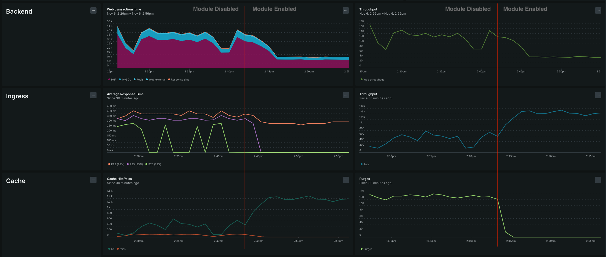

# SamJUK_CacheDebounce

[](https://github.com/SamJUK/m2-module-cache-debounce/actions/workflows/ci.yml) [](https://github.com/SamJUK/m2-module-cache-debounce/actions/workflows/ci.yml) [](https://github.com/SamJUK/m2-module-cache-debounce/releases)

This module debounces/defers/delays FPC cache purge requests to occur on a set schedule. Allowing you to make a trade off between cache accuracy and backend load.

Particularly useful for a ERP solutions that like to issue significant stock updates, in turn flushing cache regularly especially for common parent categories.

If you require a more aggressive solution, such as disabling Cache Flushes entirely then [Hypershop_SpikePerformance](https://github.com/hypershopbv/Hypershop_SpikePerformance) might be a better solution for you.


## Proof Of Concept

The module was tested on a fresh Luma store with Sample Data, running on CPX31 VPS (4vCPU, 8GB Memory).

Traffic was generated via a golang based sitemap crawler running back to back.

A stock management integration was mocked by, setting a random QTY on a random Sku every 1 second via the PUT StockItems route.




## Installation
```sh
composer require samjuk/m2-module-cache-debounce:@dev
php bin/magento setup:upgrade && php bin/magento cache:flush
```

## Configuration
Configuration can be handled via System configuration, from within the Cache Debounce menu of the SamJUK Tab.

Or can be set via the CLI with the command
```sh
php bin/magento config:set <path> <value>
```

Option | Config Path | Default | Description
--- | --- | --- | ---
Enabled | `samjuk_cache_debounce/general/enabled` | `0` | Feature flag to toggle functionality of the module
Flush Schedule | `samjuk_cache_debounce/cron/flush_schedule` | `*/5 0 0 0 0` | Cron schedule to run the scheduled flush
Stagger Enabled | `samjuk_cache_debounce/stagger/enabled` | `0` | Release a claimed batch gradually instead of purging it all at once — see below
Stagger Batch Size | `samjuk_cache_debounce/stagger/batch_size` | `50` | Tags per purge chunk
Stagger Interval (ms) | `samjuk_cache_debounce/stagger/interval_ms` | `1000` | Pause between chunks
Stagger Max Runtime (s) | `samjuk_cache_debounce/stagger/max_runtime_seconds` | `240` | Safety budget per cron/CLI invocation
Stagger Lag Ratio Threshold | `samjuk_cache_debounce/stagger/lag_ratio_threshold` | `1.0` | A run counts as "lagging" if tags arriving during the drain ≥ this ratio of tags just drained
Stagger Lag Alert After Runs | `samjuk_cache_debounce/stagger/lag_alert_after_runs` | `3` | Consecutive lagging runs before an admin notification is raised
Storage Driver | `samjuk_cache_debounce_advanced/general/storage_driver` | `db` | Queue storage backend — `db` or `redis`. A deploy-time infra decision, not a store setting — see below

This one is a deliberate exception to "Configuration can be handled via System configuration" above: it's hidden from Stores > Configuration entirely (`showInDefault`/`showInWebsite`/`showInStore` all `0`) and gated behind its own ACL resource (`SamJUK_CacheDebounce::storage_driver`) that isn't granted to any role by default. It exists only so `config:set` has a registered path to write to. Set it with:
```sh
php bin/magento config:set samjuk_cache_debounce_advanced/general/storage_driver redis
```
Add `-e` to lock it into `app/etc/env.php` instead of `core_config_data`, removing Admin overridability entirely.

**Only switch drivers when the queue is empty** (`samjuk:cache-debounce:status` shows zero pending and no active batch). Each driver only sees its own storage — switching mid-flight leaves whatever was queued in the old backend stranded there, invisible to the new one, until something re-queues the same tags.

### Redis storage driver

The `redis` driver connects via a dedicated `app/etc/env.php` block:
```php
'cache_debounce' => [
    'redis' => [
        'host' => '127.0.0.1',
        'port' => '6379',
        'password' => '',
        'database' => '2',
    ],
],
```

If that block is absent, the module falls back to whatever Redis backend is already configured for the `page_cache` cache frontend, so it works zero-config once the driver is switched on.

> **Note:** sharing the page cache's Redis instance means pending purge tags are subject to that instance's `maxmemory-policy`. If it's `allkeys-lru`/`allkeys-lfu` (common for FPC), tags can be silently evicted under memory pressure. Configure a dedicated block above to avoid this.

### Staggered / batched purge release

On a large debounce window, a single `flush()` can send hundreds of tags to Varnish in one instant — a CPU/IO spike exactly when the store is under load. Enabling `stagger` releases a claimed batch gradually instead: chunked into `batch_size`-sized purge requests, paced by `interval_ms`, within a `max_runtime_seconds` budget per cron/CLI invocation. Both the cron job and `samjuk:cache-debounce:flush` route through this — a single-shot flush when disabled (the pre-existing behavior), a paced release when enabled.

An interrupted run (deploy, OOM-kill, timeout) leaves its batch claimed but not cleared; the next invocation resumes it — by re-purging its full tag list, not from a persisted chunk offset. A Varnish BAN is idempotent, so the cost of that is, at worst, a handful of redundant purges.

Only one release runs at a time, guarded by `Magento\Framework\Lock\LockManagerInterface`. If release throughput can't keep up with ingestion, it's logged as a warning, surfaced in the admin bell-icon notifications after `lag_alert_after_runs` consecutive lagging runs, and re-raised every `lag_alert_after_runs` runs for as long as the condition persists.

Check current state with:
```sh
php bin/magento samjuk:cache-debounce:status
```

### Adding your own storage driver

Drivers are resolved from an array bound in `etc/di.xml`, keyed by the value of `storage_driver`. Any module can add an entry to extend it, without touching this module's `di.xml`:
```xml
<type name="SamJUK\CacheDebounce\Model\Storage\Pool">
    <arguments>
        <argument name="drivers" xsi:type="array">
            <item name="my_driver" xsi:type="string">Vendor\Module\Model\Storage\MyDriver</item>
        </argument>
    </arguments>
</type>
```
`MyDriver` just needs to implement `QueueStorageInterface`. Then `bin/magento config:set samjuk_cache_debounce_advanced/general/storage_driver my_driver`.

## Will this help my store?

The performance improvement comes from improving cache performance by reducing the amount of cache purge requests in turn reducing system load.

To check how many cache invalidations your system is issuing, you can enable debug logging, which will add some `cache invalidate` entries to your `var/log/debug.log` file.

```sh
php bin/magento setup:config:set --enable-debug-logging=true && php bin/magento cache:flush
```

If you do not want to enabling debug logging in production for some reason, maybe log ingest limitations. You can patch the invalidation logger to change the log level to `info`, so they appear within the `system.log` file.

```diff
--- vendor/magento/framework/Cache/InvalidateLogger.php
+++ vendor/magento/framework/Cache/InvalidateLogger.php
@@ -43,7 +43,7 @@
      */
     public function execute($invalidateInfo)
     {
-        $this->logger->debug('cache_invalidate: ', $this->makeParams($invalidateInfo));
+        $this->logger->info('cache_invalidate: ', $this->makeParams($invalidateInfo));
     }

     /**

```
